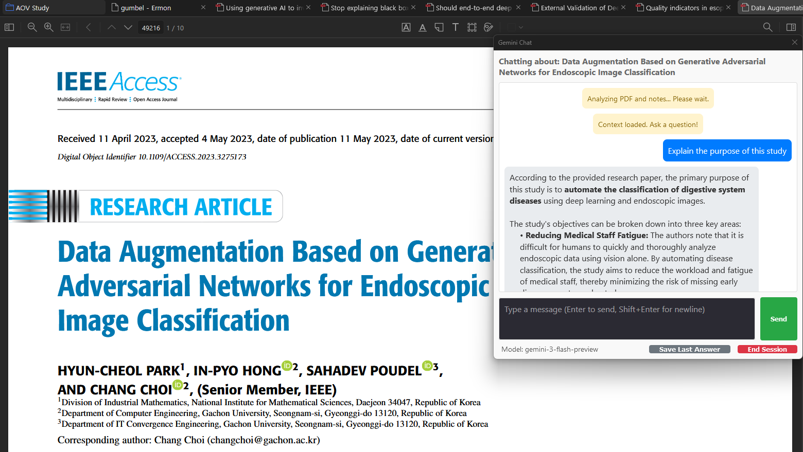
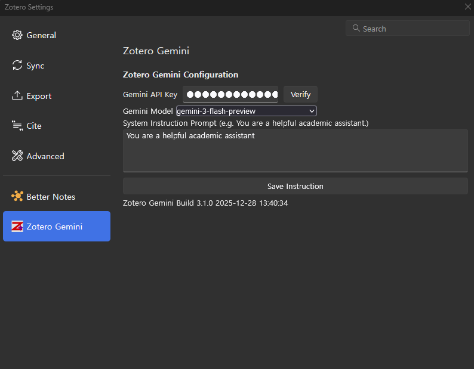

# Zotero Gemini

Zotero 7 plugin for interacting with Google Gemini AI models.

Based on: [zotero-plugin-template](https://github.com/windingwind/zotero-plugin-template)

## Features

- **Context-Aware Chat**: Interrogate selected Zotero items. Context includes PDF full-text and existing Zotero notes.
  
  [Captured Paper](https://ieeexplore.ieee.org/document/10122914)
- **Rich Text Rendering**: 
  - Standard Markdown (Bold, Italic, Tables, etc.) via `markdown-it`.
  - Mathematical Formulas ($E=mc^2$) via `KaTeX` (Offline Bundled).
- **Smart Note Saving**: 
  - Save Q&A pairs as Zotero Notes with the **Question as the Note Title**.
  - Preserves all formatting (Tables, Math) exactly as seen in the chat.
- **Knowledge Synthesis**: 
  - **"Synthesize Notes"**: Consolidates all child notes of an item into a comprehensive "Final Knowledge" document.
  - **Auto-Backup**: Automatically backs up previous knowledge notes (`Final Knowledge_oldN`) to prevent data loss.
- **Session Persistence**: Chat history is saved per item and restored upon reopening.
- **Window Management**: 
  - Toggle visibility with `Ctrl+/` (or `Cmd+/` on Mac).
  - Remembers last window position and dimensions.
- **Dynamic Model Selection**: Select from available Gemini models (e.g., flash, pro) via settings.
- **Custom System Instructions**: Define a custom persona or instruction (e.g., "You are a strict academic") in preferences.
- **Localization**: Fully localized for **English** and **Korean**.
- **API Verification**: In-settings API key validation and model list fetching.
  

## Environment

- OS: Windows 11
- Zotero: 7.0.30

## Installation

1. Download `.xpi`.
2. Install via Zotero **Tools** -> **Add-ons**.
3. Set API Key in **Edit** -> **Settings** -> **Zotero Gemini**.

## Development

- **Prerequisites**: Node.js 18+
- **Build**: `npm install` followed by `npm run build`.

## Project Files

- `addon/`: Plugin chrome and UI code.
- `src/`: TypeScript application logic.
- `tools/`: Build automation.
